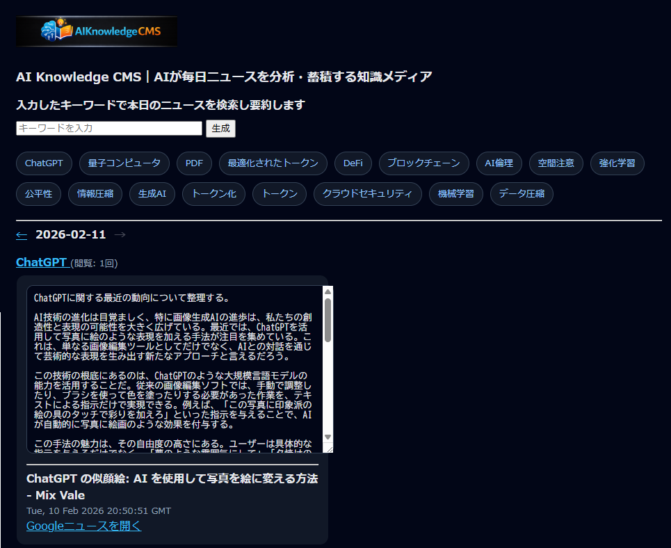
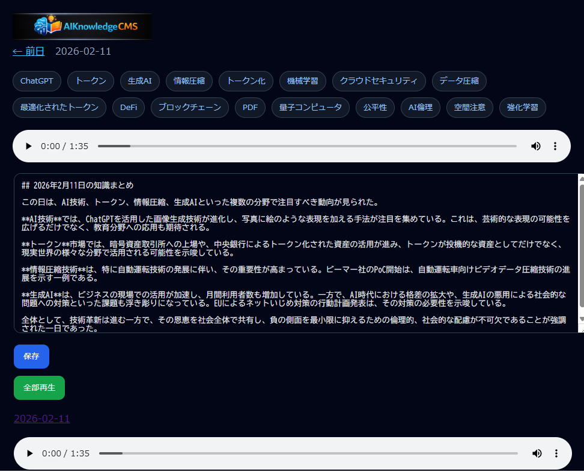
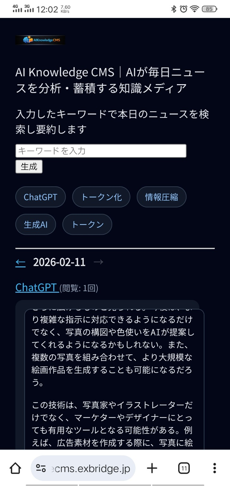

# AIKnowledgeCMS

AIKnowledgeCMS is an AI-powered knowledge engine that continuously collects, structures, summarizes, and preserves domain-specific information as long-term accumulated knowledge.

Rather than publishing content, it is designed to **compound understanding over time**.

---

## Why AIKnowledgeCMS Exists

Most CMS platforms are optimized for:

- Publishing frequency
- SEO and visibility
- Manual content updates

AIKnowledgeCMS takes a fundamentally different stance.

- Learning happens continuously, even without posting
- Knowledge should compound, not reset daily
- A system should stay alive without constant human input
- Daily summaries should emerge naturally from accumulated knowledge

This project exists to support **quiet, consistent knowledge accumulation** driven by genuine interests, not engagement metrics.

---

## What AIKnowledgeCMS Does

AIKnowledgeCMS operates as an autonomous knowledge engine:

- Collects information from predefined, trusted sources
- Structures and analyzes content using AI-assisted logic
- Stores results as structured, date-based knowledge JSON
- Generates daily structured summaries (`daily_summary.php`)
- Preserves all historical context without overwriting
- Provides lightweight first-party tracking (`simpletrack.php`)

The system grows naturally alongside your thinking, research, or observation process.

---

## How It Works (Conceptual Flow)

1. External information is collected per topic or keyword
2. Each item is structured and stored as knowledge JSON
3. Daily knowledge is automatically summarized
4. Summaries can optionally feed downstream audio/media layers
5. Knowledge remains accessible, searchable, and cumulative

Nothing is overwritten.  
Nothing is optimized for trends.  
Everything compounds.

---

## Core Components

AIKnowledgeCMS is intentionally split into small, role-specific components.

- `aiknowledgecms.php`  
  Handles CMS-level responsibilities such as:
  - Data storage
  - Daily views
  - Keyword navigation
  - Manual edits when needed

- `daily_summary.php`  
  Generates structured daily summaries from accumulated knowledge.

- `simpletrack.php`  
  Provides lightweight, privacy-first, first-party analytics without external dependencies.

- `aiknowledgecms.py`  
  Performs AI-assisted processing, including:
  - Content analysis
  - Knowledge extraction
  - Structured JSON generation

- `news2audio.py`  
  Converts accumulated knowledge into audio-ready scripts, enabling optional narration or radio-style output.

This separation keeps knowledge accumulation stable while allowing summary, analytics, and media layers to evolve independently.

---

## Screenshot

---

## What AIKnowledgeCMS Is NOT

- Not a news aggregator
- Not an SEO-focused content generator
- Not a social media automation tool
- Not designed for virality or volume

AIKnowledgeCMS values **relevance, continuity, and clarity** over reach.

---

## Intended Use Cases

AIKnowledgeCMS is suited for:

- Personal knowledge engines
- Long-term research tracking
- Domain-focused learning archives
- Small teams sharing accumulated understanding
- Systems that require daily structured intelligence snapshots

It works best where **thinking long-term matters more than posting often**.

---

## Project Philosophy

AIKnowledgeCMS follows a simple order:

1. Learn continuously
2. Structure what matters
3. Generate daily clarity
4. Let knowledge accumulate naturally

Any outward expression (articles, audio, summaries, media) should be a **byproduct**, not the objective.

---

## Runtime Architecture

AIKnowledgeCMS runs as a layered but minimal system:

### Web Layer (PHP)
- Public browsing & keyword navigation
- JSON storage (`/data/*.json`)
- Daily summary rendering
- Lightweight tracking (`simpletrack.php`)
- API endpoints for workers and audio upload

### Worker Layer (Python)
- Autonomous keyword expansion
- Daily knowledge generation
- Non-interactive background execution

### Summary Layer
- Structured daily intelligence snapshots
- Date-based preservation model

### Optional Media Layer
- Audio generation (daily summary)
- Downstream integration (AIRadio, video pipelines, etc.)
- Media output is strictly downstream

---

## Relationship to Other Projects

AIKnowledgeCMS can function independently, but is designed to integrate cleanly with external systems such as:

- AIRadio
- Script-based audio or video generation pipelines
- AI-driven live distribution layers

By separating knowledge storage from media execution, the system remains reusable, extensible, and resilient.

---

## Status

This project is actively used in a real production environment and continues to evolve.

Current development focuses on:

- Stability of daily knowledge accumulation
- Refinement of daily summary generation
- Lightweight, privacy-first tracking
- Clear separation between knowledge and media layers

---

## License

MIT License

